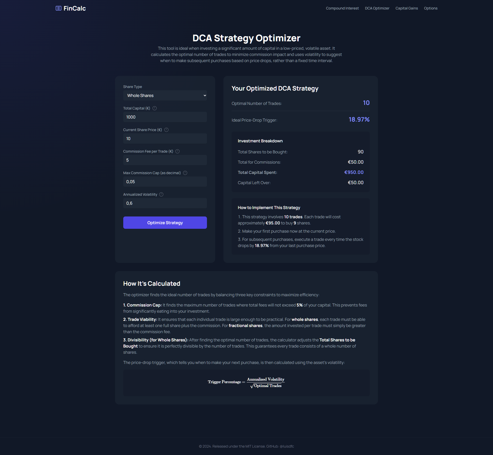
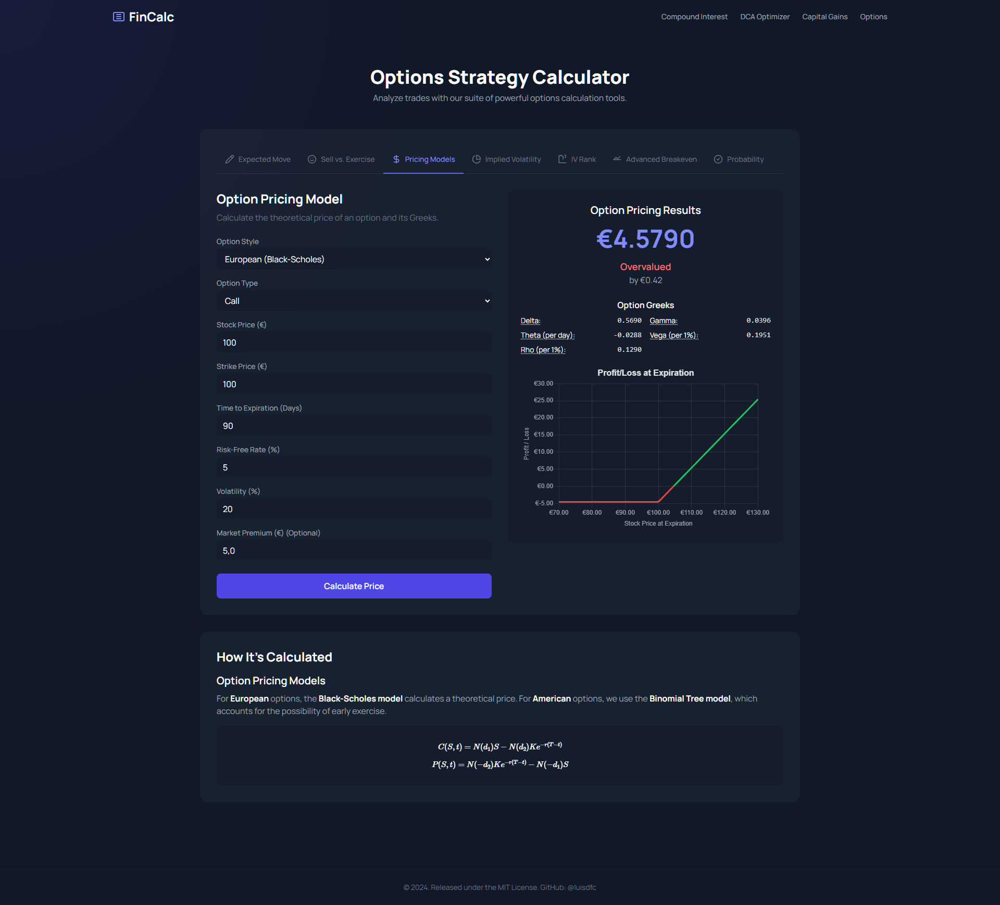

# 📊 FinCalc: Web-Based Financial Calculators for Investors

[](https://www.python.org/)  
[](https://flask.palletsprojects.com/)  
[](LICENSE)

**FinCalc** is a modern, easy-to-use web application that provides a suite of powerful financial calculators. Designed for investors who want to make informed, data-driven decisions, FinCalc simplifies complex financial questions with a clean and intuitive interface.

---

## ✨ Features

This application includes four key calculators, each with unique functionalities:

### 1. 📈 Compound Interest Calculator
A versatile tool that not only projects the future value of your investments but can also solve for any missing variable. You can calculate:
- **Final Balance**: See how your investment will grow over time.
- **Time to Goal**: Determine how long it will take to reach a specific financial target.
- **Required Periodic Deposit**: Find out how much you need to save regularly to meet your goals.
- **Required Interest Rate**: Calculate the annual return needed to reach your target.
- **Required Initial Balance**: Determine the starting principal needed to achieve a future sum.

---

### 2. 💰 DCA Strategy Optimizer
An advanced tool to find your optimal **Dollar-Cost Averaging (DCA)** strategy. This calculator helps you balance commission costs by allowing you to set a custom **commission cap** (e.g., max 5% of capital for fees). It then determines the ideal number of trades and a price-drop percentage—based on the asset's volatility—that should trigger your next investment. The tool fully supports both **whole** and **fractional** share strategies, ensuring the plan is perfectly executable.

---

### 3. 🔄 Capital Gains Opportunity Cost
Decide if it’s worth selling an asset to reinvest elsewhere by calculating the **breakeven return** required on a new investment to make up for the taxes you'll pay on the sale of the first one.

---

### 4. ⚖️ Options Strategy Calculator
A comprehensive, multi-functional tool designed for options traders to analyze trades from every angle:

- **Market's Expected Move**: Estimate the potential price swing of a stock based on the prices of its at-the-money (ATM) straddle.
- **Sell vs. Exercise**: Compare the financial outcomes of selling an in-the-money option versus exercising it to help maximize your profit by capturing any remaining extrinsic value.
- **Option Pricing Models**: Calculate the theoretical value of both European (Black-Scholes) and American (Binomial Tree) options. It includes a detailed breakdown of the Greeks (**Delta, Gamma, Theta, Vega, Rho**) with clear explanations to help you understand the option's risk and reward profile.
- **Implied Volatility (IV) Analysis**: Reverse-engineer an option's market price to find the implied volatility, giving you insight into the market's expectation of future price swings. This section now includes a graph plotting the option's price against different IV levels.
- **IV Rank**: Contextualize the current IV by comparing it to its 52-week high and low, helping you determine if options are relatively cheap or expensive.
- **Advanced P/L Breakeven**: Determine the exact stock price movement required to break even on a trade before expiration. This calculator accounts for time decay (Theta), changes in implied volatility (Vega), and transaction costs to provide a precise target for your trade.
- **Probability Calculator**: Estimate the probability of an option expiring in-the-money (using Delta) and the likelihood of the underlying stock touching a specific price target before expiration.

---

## 📸 Screenshots

Here's a look at the FinCalc interface:

**Main Page**


**Compound Interest Calculator**


**DCA Strategy Optimizer**


**Capital Gains Opportunity Cost Calculator**


**Options Strategy Calculator**


---

## 🚀 Getting Started

### 1. Prerequisites
- Python 3.x installed  

### 2. Installation
Clone the repository:

```bash
git clone <repository-url>
cd <repository-folder>

```
Install the required Python packages using pip:
```bash
pip install -r requirements.txt
```

### 3. Running the Application
Once the dependencies are installed, you can start the Flask web server:

```bash
python app.py
```
The application will be running at:

http://127.0.0.1:5000

Open this URL in your web browser to start using the calculators.

## 🤝 Contributing

Contributions are welcome!
1. Fork the repo
2. Create a feature branch (git checkout -b feature-name)
3. Commit changes (git commit -m "Add feature")
4. Push and open a Pull Request

## 📜 License

This project is licensed under the MIT License.
